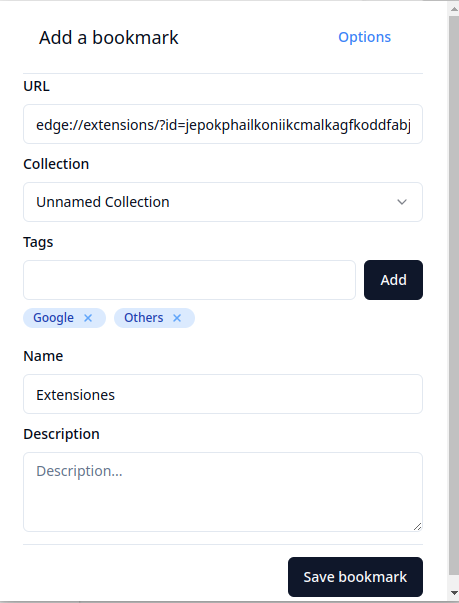
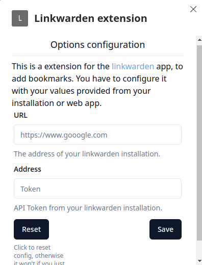

# Linkwarden extension

Extension for [Linkwarden](https://github.com/linkwarden/linkwarden), a self-hosted, open-source collaborative bookmark
manager to
collect, organize and archive webpages.

**Features**

- Add new links to linkwarden with a single click
- Keyboard shortcut to quickly add links<kbd>Alt + Shift + K</kbd>

Currently works on Chrome and Firefox. (Safari to be tested)

**Images**




## Manual Installation (Only for now and development)

### Requirements

(Could work with older versions, but not tested, let me know if you have any issues)

- LTS NodeJS 18.x.x
- NPM Version 9.x.x
- bash

### Build

Make sure you are able to run the build script included in repository.

```
chmod +x ./build.sh
./build.sh
```

Then take the dist folder and load it as an unpacked extension in your browser.
Now it should be working!.

